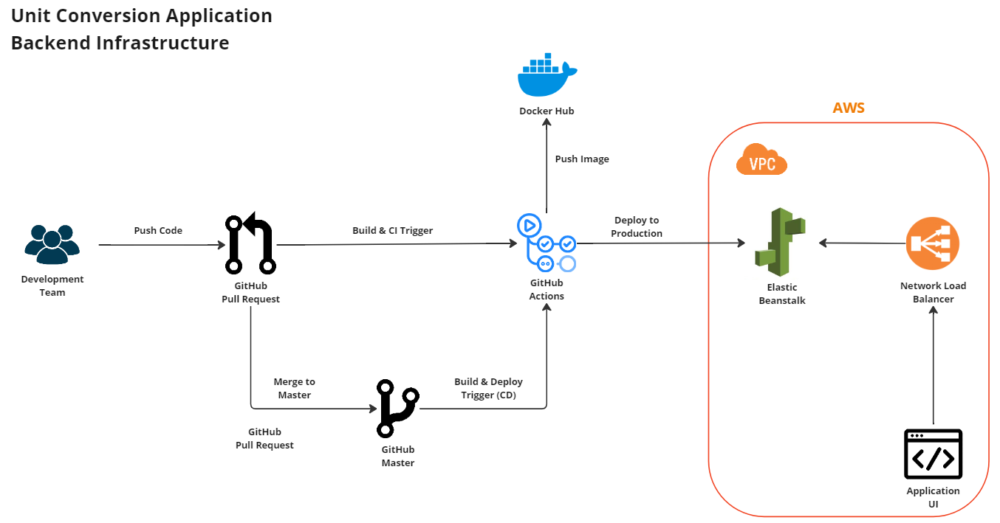

# Unit Conversion Backend Application

## Problem Statement

Our users are science teachers who are as comfortable using the command line as they are using a browser. In their “Unit Conversion” science unit, they want to assign students unit-conversion problems on paper worksheets. After students turn in their completed worksheets, the teachers want to be able to enter the questions and student responses into a computer to be graded. 

Students will convert:
* temperatures between Kelvin, Celsius, Fahrenheit, and Rankine
* volumes between liters, tablespoons, cubic-inches, cups, cubic-feet, and gallons

This repository contains the code for a unit conversion backend application containing a service to assist teachers with conversion validation.

Public API Endpoint: [http://kw-unit-conversion.us-east-1.elasticbeanstalk.com/unit-conversion](http://kw-unit-conversion.us-east-1.elasticbeanstalk.com/unit-conversion)

Sample Request: http://kw-unit-conversion.us-east-1.elasticbeanstalk.com/unitconversion?type=temperature&value=100&unit=celsius&target=fahrenheit&response=212

Public API Documentation: [http://kw-unit-conversion.us-east-1.elasticbeanstalk.com/swagger-ui/index.html](http://kw-unit-conversion.us-east-1.elasticbeanstalk.com/swagger-ui/index.html)


## Installation and Usage

### Prerequisites
- Java 17 or later
- Maven

### Installation
1. Clone this repository to your local machine.
   ```
   git clone git@github.com:Kevin1289/unit-conversion-backend.git
   ```
2. Navigate to the project directory.
   ```
   cd unit-conversion-backend
   ```
3. Copy git hook files into your .git/hooks folder
   ```
   cp git-hooks/* .git/hooks/
   ```

### Running the Application Locally
1. Build the project using Maven:
   ```
   mvn clean install
   ```
2. Run the application:
    ```
    java -jar target/unit-conversion.jar
    ```
3. The application will be accessible at `http://localhost:8080`.
4. The API documentation can be found at `http://localhost:8080/swagger-ui/index.html`.

### Running the Tests
1. Run the tests using Maven:
   ```
   mvn test
   ```

### Code Linting, Code Quality, and Security Checks
1. Run all checks using Maven:
   ```
   mvn verify
   ```
**Use following commands to run individual plugins:**
1. Run the checkstyle plugin:
   ```
   mvn checkstyle:check
   ```
2. Run the PMD plugin:
   ```
   mvn pmd:check
   ```
3. Run the dependency-check plugin:
   ```
   mvn dependency-check:check
   ```
4. Run the Jacoco plugin:
   ```
   mvn jacoco:check
   ```

## API Documentation
1. This application provides a REST API to validate unit conversions.
2. The API documentation (Swagger) can be found at `http://kw-unit-conversion.us-east-1.elasticbeanstalk.com/swagger-ui/index.html`.

## Assumptions
1. The application only supports the conversion of temperatures between Kelvin, Celsius, Fahrenheit, and Rankine.
2. The application only supports the conversion of volumes between liters, tablespoons, cubic-inches, cups, cubic-feet, and gallons.

## CI/CD Pipeline
1. The CI/CD pipeline is set up using GitHub Actions.
2. The pipeline runs tests and builds the application on every push to a branch and pull request.
3. The pipeline deploys the application to AWS Elastic Beanstalk on every push to the `main` branch.

## Infrastructure

1. The application is deployed on AWS Elastic Beanstalk for several reasons:
   - It is a Platform as a Service (PaaS) that abstracts the underlying infrastructure.
   - It is easy to deploy and manage applications.
   - It provides auto-scaling and load balancing capabilities.
   - It supports multiple programming languages and frameworks.
   - It provides a free tier for new users.
2. The application leverages a network load balancer to distribute incoming traffic across multiple targets.
3. The application is deployed in the `us-east-1` region.
4. The application pushes docker image to Docker Hub for accessability and versioning.



# Development prioritization in near future:

1. Allow CICD pipeline to deploy to multiple environments (dev, staging, prod)
2. Implement proper versioning of the application and docker image
3. Implement logs and monitoring for the application (AWS CloudWatch, DataDog)
4. Improve CD pipeline to leverage Terraform for infrastructure as code
5. Leverage professional documentation tools like Confluence for better documentation and knowledge sharing among developers
6. Deploy application at specific region based on the location of majority of users